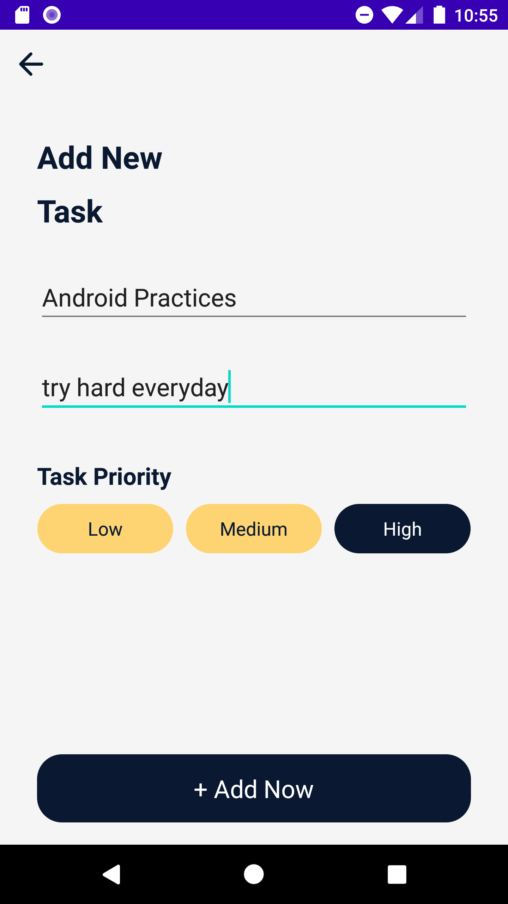

# **Taskie**

## **Purpose**
To show possibilities and good practices using Kotlin language.

## **Description**
Application connects to Taskie Rest API to get response data

## Screenshots
|  |  |   |
| :---:                              | :---:                             | :---:                              |
|   |  |   |
|   |  |   |
| 

## **Libraries/concepts used**

* MVP architecture
* Retrofit - for networking
* Gson converter - for JSON parsing
* Room - database
* Koin - for service locator pattern implementation
* Android Architecture Components (ViewModel classes)
* Kotlin coroutines - to manage threads gracefully
* Kotlin View Binding - to ease connection with XML code
